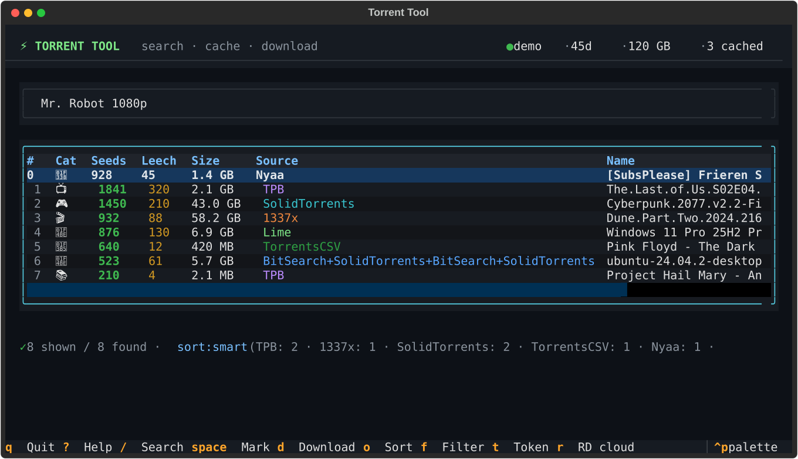
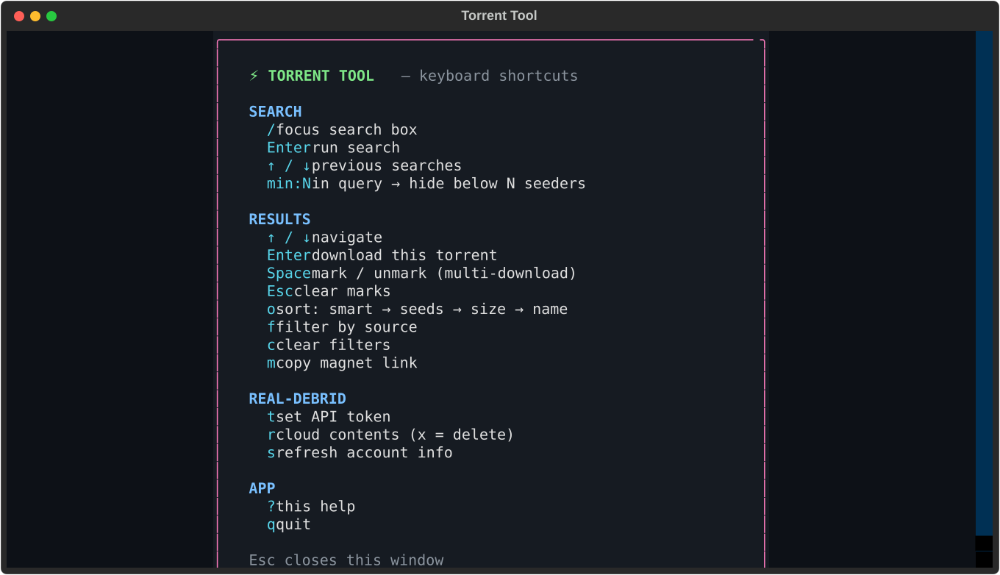

# ⚡ Odyssey Searcher

**v1.0 Beta** — feature-complete enough to be useful, young enough to make
excuses. no changelog yet — it's brand new. the git history is the changelog.

Search 10 open trackers at once, dedupe the noise, and push whatever you pick
through **Real-Debrid** — from a terminal that doesn't look like 1995.



> this started as a "fine, i'll write my own" project because i got tired of
> opening five tracker tabs and copy-pasting magnets. it was called "torrent
> tool" for a while — accurate, and *so boring*. meet odyssey.

## what it actually does

you type a search. it hits 10 trackers in parallel, merges the same torrent
across sites into one row, drops the SEO bait, and ranks by relevance + seeders.
then the Real-Debrid part takes over:

1. **instant check** — it asks RD which results are already sitting in their
   cache and marks them with a ⚡. cached = plays in seconds. no waiting.
2. press `Enter` (or mark a few with `Space` and hit `d`) — it adds the magnet,
   waits for it to be ready, and downloads with a progress bar.
3. **cached-only mode** (`c`) hides everything that isn't instant. for people
   with no patience. (hello.)



## features, in no particular order

- **10 engines in parallel** — SolidTorrents, TPB (the real API, not a scraper),
  1337x, TorrentsCSV, Nyaa, BitSearch, BitMusic (music-only), Torlock,
  LimeTorrents, Archive.org (the legal one). the status bar shows per-engine
  counts so you can see which tracker is having a mood today.
- **beat packs & drum kits** — a drum kit, boom bap pack or sample kit gets a
  🥁 badge. search "boom bap kit" and BitMusic + Archive.org actually deliver,
  legally in Archive's case.
- **infohash dedup** — the same release on three sites shows up as one row with
  `TPB+1337x` as the source. keeps the highest-seeded copy.
- **smart ranking** — relevance first. `ubuntu 24.04` gives you actual ISOs, not
  "totally unrelated spam upload (9999 seeders)". those seed counts are lies, by
  the way.
- **bait filter** — `[REAL]`, `Full Version`, `Direct Download!!1` and friends
  get dropped before you ever see them. (yes, it's personal.)
- **category badges** — 📺 🎬 🎮 🎵 📚 💾 🌸 🥁 guessed from the name. it's wrong
  sometimes. it's fine.
- **Real-Debrid pipeline** — magnet → RD cache → unrestricted links → download.
  your ISP sees exactly one https connection to debrid, which is honestly the point.
- **⚡ instant badge** — results already in RD's cache are flagged before you
  click, and `c` flips to cached-only. the feature i actually use the most.
- **multi-select queue** — mark a handful, press `d`, walk away.
- **hidden local db** — RD token (encrypted), search history, a download log,
  a blacklist, prefs — one sqlite file in `~/.odyssey`.
- **`x` hides a result forever** — the blacklist. torlock's "verified 6000
  seeders" uploads go straight to hell where they belong.
- **full CLI** — every engine is reachable from a shell script too.

## install

```bash
pip install -r requirements.txt
```

you need a Real-Debrid account — it's the whole point. grab an API token at
<https://real-debrid.com/apitoken>, then:

```bash
python odyssey.py token <token>     # or press t inside the TUI
```

## usage

```bash
python odyssey.py        # TUI
python odyssey.py ui     # same thing, but louder
```

### keys

| key | what it does |
|---|---|
| `/` | focus search (↑/↓ browsed your history) |
| `Enter` | download this torrent |
| `Space` | mark / unmark · `Esc` clears marks |
| `o` | sort: smart → seeds → size → name |
| `f` | filter by source |
| `c` | toggle ⚡ cached-only |
| `C` | clear all filters |
| `x` | hide this result (blacklist) |
| `m` | copy the magnet |
| `t` / `r` / `s` | token / RD cloud / refresh |
| `?` | help · `q` quit |

search syntax: `min:N` hides anything under N seeders.
`Mr. Robot 1080p min:20` → only non-bait Mr. Robot at 1080p with 20+ seeders.

### CLI (same engine, scriptable)

```bash
python odyssey.py search "ubuntu 24.04" --sort smart --min-seeds 5 -n 10
python odyssey.py search "frieren" --cached                # only ⚡ instant
python odyssey.py search "frieren" --download 0            # straight to RD
python odyssey.py download "magnet:?xt=..."                # direct magnet
python odyssey.py status                                   # account/traffic
python odyssey.py rd --delete 2                            # RD cloud mgmt
python odyssey.py history            # --clear to nuke it
python odyssey.py downloads          # what you grabbed recently
python odyssey.py blacklist --wipe   # let the spammers back in. your call.
python odyssey.py prefs --sort smart --dl-dir "D:\videos"
```

## quirks you'll bump into

- **1337x, Torlock and Lime don't put the magnet in search results.** this tool
  fetches it from the details page anyway, which makes those engines half a
  second slower. nothing i can do about that.
- **torlock seed counts are optimistic.** the smart ranking exists partly because
  of this.
- **RD links expire.** if a download dies mid-flight with a 403, re-run it. the
  tool refuses to save the 403 error page as your movie these days (that used to
  be a bug).
- downloads go to `~/Downloads/Odyssey/` by default. `prefs --dl-dir` moves it.
- **archive.org results report 0 seeders** — it's a library, not a swarm. they
  surface in smart sort by relevance, and get filtered out if you use `min:N`.

### vs. the alternatives

- **Stremio + Torrentio + RD** — great for *watching*, but it's an app with a TV
  interface and it doesn't really search; you browse what the addon serves.
- **jDownloader / Plowshare** — they don't search at all. you feed them links.
- **qBittorrent + VPN** — you're seeding to strangers and your IP talks to the
  swarm. this tool never touches the swarm.

this tool is: search + debrid in one terminal screen.

## files & privacy

- everything lives in `~/.odyssey/settings.db` — encrypted token, history,
  download log, blacklist, ⚡ cache, prefs. it sits *outside* the repo on purpose
  so your token never ends up on GitHub.
- your IP talks to the trackers (search) and real-debrid (everything heavy).
  the actual data comes from RD's CDN, not from the swarm.

## roadmap (stuff i keep meaning to do)

- [x] ⚡ instant badge + cached-only mode
- [x] hidden local db (history, blacklist, prefs, download log)
- [ ] `v` = stream straight into VLC instead of downloading
- [ ] saved searches that auto-grab new releases into RD
- [ ] all-debrid / other providers
- [ ] actually render the demo gif for this readme

## disclaimer

for educational purposes. what you download is on you. it works on my machine,
which is the important part. ⭐ if it works on yours.
